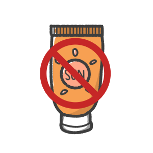
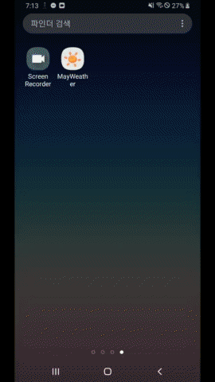

# program42
#날씨 확인 어플리케이션#

<중요코드는 program42/MayWeather/app/src/main/java/com/example/ 에 있습니다!!>

-개발프로그램 : Android Studio

-개발 언어 : java

#주요기능#

1 . 미세먼지 농도에 따른 마스크 추천


2 . 자외선 지수에 따른 썬크림 추천




3 . 기본적인 온도 및 강수량 체크

4 . 7일 간 날씨 예보\



ex) 날씨 분류 코드
```java
//현재 날씨 이미지 설정
    void setWeatherImageview(String id , ImageView view){
        if ((id.equals("200")) || (id.equals("230")) || (id.equals("231")) || (id.equals("232"))){
            view.setImageResource(R.drawable.rain); //번개 & 여우비
        }
        else if (id.equals("201")){
            view.setImageResource(R.drawable.thuntherstorm);
            //return "번개/비";
        }
        else if (id.equals("202")){
            view.setImageResource(R.drawable.thuntherstorm);
            // return "번개/폭우";
        }
        else if ((id.equals("210")) || (id.equals("211")) || (id.equals("212"))){
            view.setImageResource(R.drawable.thuntherstorm);
            //return "천둥 번개";
        }
        else if (id.equals("221")){
            view.setImageResource(R.drawable.rain);
            //return "폭풍우";
        }
        else if((id.equals("300")) || (id.equals("301"))|| (id.equals("302"))|| (id.equals("310"))|| (id.equals("311"))|| (id.equals("312"))|| (id.equals("313"))|| (id.equals("314"))|| (id.equals("321"))){
            view.setImageResource(R.drawable.rain);
            // return "여우비";
        }
        else if(id.equals("800")){
            view.setImageResource(R.drawable.clear_sky);
            //return "맑음";
        }
        else if((id.equals("701")) || (id.equals("721")) || (id.equals("741"))){
            view.setImageResource(R.drawable.mist);
            // return "안개";
        }
        else if((id.equals("731")) || (id.equals("751")) || (id.equals("761"))){
            view.setImageResource(R.drawable.dust);
            //황사
        }
        else if(id.equals("711")){
            view.setImageResource(R.drawable.dust);
            // return "스모그";
        }

        else if(id.equals("762")){
            view.setImageResource(R.drawable.dust);
            //return "화산재";
        }
        else if((id.equals("781")) || (id.equals("771"))){
            view.setImageResource(R.drawable.thuntherstorm);
            //return "태풍";
        }
        else if(id.equals("500")) {
            view.setImageResource(R.drawable.rain);
            // return "여우비";
        }
        else if(id.equals("501") || id.equals("520") || id.equals("521")) {
            view.setImageResource(R.drawable.rain);
            // return "비";
        }
        else if(id.equals("502") || id.equals("503") || id.equals("504") || id.equals("522") || (id.equals("531"))){
            view.setImageResource(R.drawable.rain);
            //return "폭우";
        }
        else if(id.equals("511")){
            view.setImageResource(R.drawable.snow);
            // return "우빙";
        }
        else if(id.equals("600") || id.equals("601") || id.equals("621")){
            view.setImageResource(R.drawable.snow);
            // return "눈";
        }
        else if(id.equals("602") || id.equals("622")){
            view.setImageResource(R.drawable.snow);
            // return "폭설";
        }
        else if(id.equals("611") || id.equals("612") || id.equals("613") || id.equals("615") || id.equals("616") || id.equals("620")){
            view.setImageResource(R.drawable.rain);
            // return "진눈깨비";
        }
        else if(id.equals("801")){
            view.setImageResource(R.drawable.sun_cloud);
            //  return "구름 조금";
        }
        else if (id.equals("802") || id.equals("803")){
            view.setImageResource(R.drawable.sun_cloud);
            //  return "구름";
        }
        else if (id.equals("804")){
            view.setImageResource(R.drawable.cloud);
            // return "구름 많음";
        }
    }
    ```

